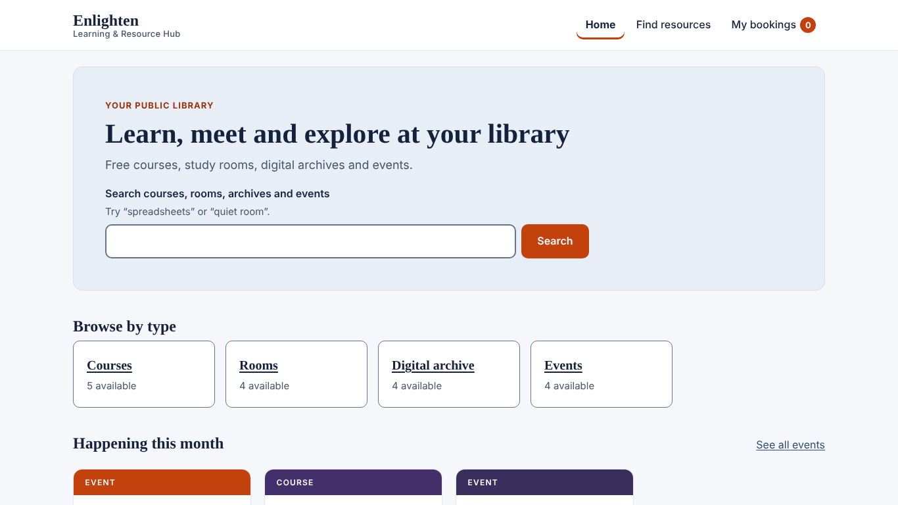
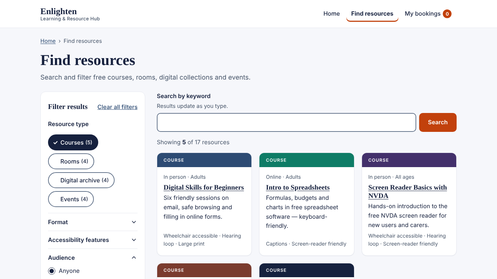
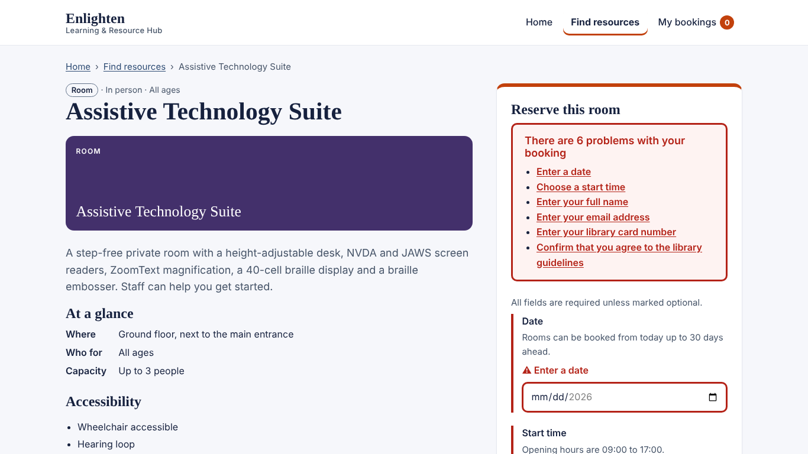
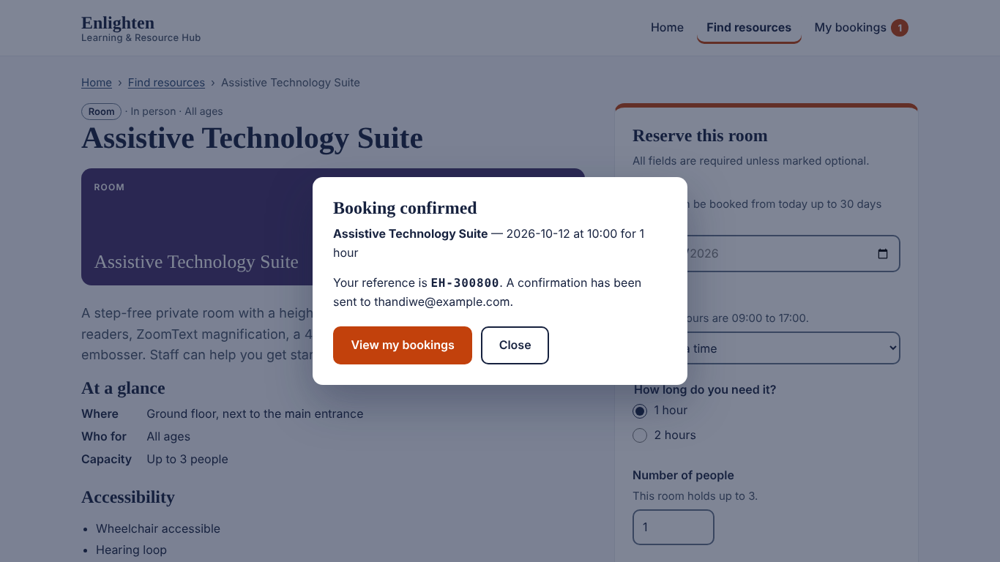
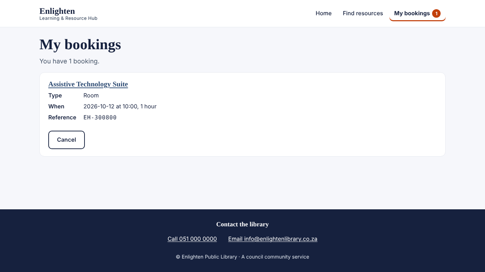

# Enlighten — Learning & Resource Hub

## Introduction

Enlighten is an accessible React application for a local public library. Visitors can search free courses, reserve study rooms, request accessible copies from the digital archive and register for events, using only a keyboard or a screen reader if they need to. It grows out of my earlier project, *Enlighten — Public Library* (a vanilla HTML/CSS/JS eBook store): the colours, fonts and the browse → detail → book flow are carried over and rebuilt in React with accessibility as a first requirement, not an extra.

The brief assigns the domain from the last digit of the candidate's ID. My Candidate ID ends in an **odd** number, so this is the **Local Public Library — Adaptive Learning & Resource Portal**.

## Live Site

**[Open Enlighten](https://codeswithbux.github.io/Local-Public-Library/)**

To run it on your own machine (Node.js 20.19 or newer):

```bash
git clone https://github.com/CodesWithBux/Local-Public-Library.git
cd Local-Public-Library
npm install
npm run dev      # opens on http://localhost:5173
npm test         # 27 component and accessibility tests
npm run deploy   # builds the site and publishes it to GitHub Pages
```

## What the App Does

- Browse 17 sample resources: courses, study rooms, digital archive items and events
- Filter by type, format, accessibility feature and audience, or search by keyword
- Hear the number of results read out each time a filter changes
- Jump straight from the filters to the results with a "Skip to results" link
- Open any resource to see its details and an accessible booking form
- Get clear, written error messages, with a summary that links to each field
- See a confirmation dialog with a booking reference, and close it with Escape
- View and cancel bookings on the My bookings page; bookings are saved in the browser
- Contact the library by phone or email from the footer on every page

## Screenshots

Taken on a laptop screen (1366 × 768).

### Home page


### Find resources, with Courses selected


### Booking form after an empty submit


### Booking confirmed


### My bookings


## Project Structure

```
Local-Public-Library/
├── wireframes/              Part A — plain HTML and CSS, no JavaScript
│   ├── index.html           (a) landing page
│   ├── resources.html       (b) listing and search page
│   ├── booking.html         (c) detail and booking form, shown with errors
│   ├── main.css             contrast values in comments, focus rings
│   ├── persona.md           primary assistive-technology user
│   └── wcag-matrix.md       8 WCAG 2.1 success criteria
├── src/                     Part B — the React app
│   ├── main.jsx             starts the app inside HashRouter
│   ├── App.jsx              routes, header, skip link, footer, bookings store
│   ├── App.css              colours, contrast notes and all styles
│   ├── accessibility.jsx    live announcements, page focus, form validation
│   ├── data.js              the 17 sample resources
│   ├── HomePage.jsx         landing page
│   ├── ResourcesPage.jsx    listing with filters and skip-to-results link
│   ├── ResourcePage.jsx     detail page and booking form
│   ├── BookingsPage.jsx     my bookings
│   ├── Modal.jsx            confirmation dialog
│   └── App.test.jsx         27 tests, including axe-core on every page
├── evidence/                Part C — Lighthouse report and keyboard log
├── screenshots/
├── index.html
├── package.json
├── vite.config.js
├── netlify.toml             optional, for hosting on Netlify instead
└── README.md
```

## Technologies Used

- **JavaScript (ES6+)** and **JSX**
- **HTML5** — landmarks, headings, labels, native form controls
- **CSS3** — one stylesheet with colour tokens and visible focus rings
- **React 19** — functional components, `useState`, `useEffect`, `useRef`, context
- **React Router 7** — `HashRouter`, so every page still works after a refresh on GitHub Pages
- **Vite 8** — development server and build
- **Vitest, Testing Library and axe-core** — component and accessibility tests
- **gh-pages** — publishes the build to GitHub Pages
- **Git and GitHub** — version control and hosting

---

## Part C — Accessibility Decisions

### 1. Trade-offs

**Native controls instead of custom ones.** The date is a native date input, the start time is a native dropdown, and sessions, format and audience are radio buttons. A custom calendar would look more on-brand, but it would have to rebuild the keyboard and screen reader behaviour that native controls already have. The cost is that Chrome's date field has three Tab stops (day, month, year), so keyboard users press Tab a little more. For Audience I chose radio buttons over a dropdown because there are only five options and a screen reader then says how many there are ("Anyone, 1 of 5").

**Keeping focus inside the dialog without trapping the user.** When a booking is confirmed, Tab stays inside the dialog and the rest of the page is made `inert`, so a screen reader can't wander behind it. WCAG 2.1.2 only allows this if there is an easy way out, so **Escape** and a visible **Close** button both close it, and focus goes back to the button that opened it.

**How much to announce.** Announcing every keystroke is noise. Fields are checked when you leave them, and a message is read only when a field changes from wrong to right or right to wrong ("Email address is now valid."). A failed submit moves focus to the error summary instead of shouting, because the focus move already reads it out. Result counts are announced politely after a short pause.

**Skip to results.** When I tested the listing with Narrator, getting from the filters to the results meant listening to every filter group first. I added a "Skip to results (5)" link straight after the type buttons. It only appears when it has keyboard focus, so it doesn't change the page for mouse users. I did not move focus to the results automatically when a filter is pressed: that would be an unexpected change (WCAG 3.2.2) and would stop the user picking a second filter. The cards were also simplified so each title and type is read only once.

**Hash addresses.** GitHub Pages can't send every address back to `index.html`, so refreshing `/resources` would show a 404. Using `HashRouter` fixes this, and addresses look like `#/resources` instead. Because of this, the skip link, skip-to-results and error-summary links move focus with code instead of changing the address.

### 2. How ARIA state stays in sync

Every ARIA attribute comes from React state in the same render, so what a screen reader hears always matches what is on screen:

- `aria-expanded` and the hidden panel of each filter group come from one `useState`.
- `aria-pressed` on the type buttons, the checked radio buttons, the result list and the skip link's count all come from the URL search parameters, so filters can be bookmarked.
- `aria-invalid` and `aria-describedby` (hint, then error) are worked out from the form's `errors` and `touched` state.
- `aria-busy` shows while the booking is being sent; the button uses `aria-disabled` so it keeps focus.
- The two live regions (polite and assertive) are created once in a context provider and only their text changes.
- Focus is moved with `useRef` and `.focus()`: to the page heading after navigation, to the result count after "Skip to results", to the error summary after a failed submit, into the dialog and back out, and to the next Cancel button after a booking is removed.

### 3. Verification

**Automated checks** (results in the `evidence` folder):

| Check | Result |
|---|---|
| 27 component tests: ARIA states, focus moves, announcements, tab order | All pass |
| axe-core inside the tests, every page plus the form error state | 0 violations |
| axe-core in Chrome, 13 pages and states, colour contrast included | 0 violations |
| Lighthouse Accessibility: Home, Find resources, a room, a course, My bookings | 100 on all 5 |
| Heading order, app and wireframes | One H1 per page, no skipped levels |
| Phone width (320 px) and 200% text size | No sideways scrolling |
| Wireframes (no JavaScript) | 0 violations on all 3 |

**How I ran Lighthouse:**

1. In the terminal, run `npm run build` and then `npm run preview`.
2. Open http://localhost:4173 in Chrome.
3. Press **F12** and open the **Lighthouse** tab (click **»** if it is hidden).
4. Tick only **Accessibility**, choose **Navigation** and **Desktop**, then click **Analyze page load**.
5. When it finishes, open the **⋮** menu at the top of the report and choose **Save as HTML**.
6. Save it as `evidence/lighthouse-report.html`.

**Keyboard check:** `evidence/keyboard-sequence.txt` records a full journey using only the keyboard: skip link, navigation, filters, a resource, a failed submit, fixing the fields, the dialog and Escape. Every stop has a visible focus ring and nothing traps the keyboard except the dialog, which Escape closes.

**Screen reader log:** automated tools can't confirm what a screen reader actually says, so these checks are done by hand.

Tester: ____________ · Date: ____________

| # | Step | Expected announcement | NVDA + Firefox | VoiceOver + Safari | Narrator + Edge |
|---|---|---|---|---|---|
| 1 | Load Home, move by landmark (`D`) | Banner, Primary navigation, main, "Need help…", footer | | | |
| 2 | List headings (`H`) | One H1 "Learn, meet and explore…", then H2s in order | | | |
| 3 | Activate **Find resources** | "Find resources, heading level 1" | | | |
| 4 | Press **Rooms** with Space | "Rooms (4), toggle button, pressed", then "Showing 4 of 17 resources." | | | |
| 5 | Clear Rooms, press **Courses**, Tab, Enter | "Skip to results (5), link", then focus on "Showing 5 of 17 resources" | | | |
| 6 | Open **Audience** and arrow through it | "Audience, button, expanded"; "Anyone, radio button, checked, 1 of 5" | | | |
| 7 | Open **Assistive Technology Suite** | "Assistive Technology Suite, heading level 1" | | | |
| 8 | Tab to Email | "Email address, edit, We'll send your confirmation here." | | | |
| 9 | Type `thandiwe@`, then Tab | "Email address: Enter an email address in the format name@example.com" | | | |
| 10 | Submit the empty form | "There are 6 problems with your booking" and the list | | | |
| 11 | Tab into a field with an error | "…, invalid entry, [hint], Error: [message]" | | | |
| 12 | Submit a valid form | "Booking confirmed, dialog, heading level 2" and the reference | | | |
| 13 | Tab three times, then Escape | Focus stays in the dialog; Escape returns to "Reserve room, button" | | | |
| 14 | My bookings → Cancel | "Booking EH-… cancelled."; focus moves to the next Cancel button or the heading | | | |

Keyboard-only pass (no mouse): ☐ Chrome ☐ Firefox ☐ Edge · Windows High Contrast: ☐

---

## What Changed from Enlighten v1

| Enlighten v1 | This project |
|---|---|
| A button nested inside the card link | The card title is the only link, with one Tab stop |
| Grey text at 4.45:1, just under the AA minimum | Darker text at 7.08:1; the lighter grey is used only for borders |
| A filter dropdown that didn't say whether it was open | Filter groups with `aria-expanded`, toggle buttons with `aria-pressed`, radio buttons and a spoken result count |
| Checkout errors not linked to their fields | `aria-invalid`, `aria-describedby`, an error summary that receives focus, and announcements |
| Separate pages built with `innerHTML` | A React app that moves focus and updates the page title on every route change |

Kept from v1: the colour tokens, the Fraunces and Inter fonts, the coloured cover strips, the skip link and reduced-motion support.

## Reflection

The biggest change for me was testing with a screen reader instead of only looking at the page. The site passed every automated check, but when I used Narrator the listing page felt slow and tiring, because I had to listen to every filter before reaching a single result. That led to the "Skip to results" link and simpler cards. Automated tools catch missing labels and low contrast; only listening shows whether a page is pleasant to use.

This was also my first time running an accessibility audit, and my first time using Chrome DevTools to find a tool like Lighthouse. I didn't know it was there, hidden behind the **»** menu, or that I could check my own site's accessibility from it. Learning to build the site, run the audit and save the report as HTML showed me that testing tools are already in the browser I use every day. It also showed me what Lighthouse checks, such as labels, contrast and headings, and what it can't, which is why the keyboard and screen reader checks still had to be done by hand.

Getting the project running and online taught me just as much. Vite needed a newer version of Node than I had, merging changes uploaded on GitHub with my local copy caused conflicts I had to resolve, and GitHub Pages needed `HashRouter` so pages would still load after a refresh. Working through each of these step by step, and checking what was actually deployed rather than assuming, is what got the site live.

---

*Sample data only: resources, times and availability are made up. Bookings are simulated and saved only in your browser.*

Built by Phatsimo Maseng.
